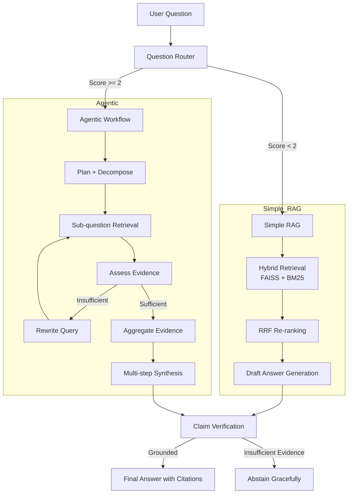

# Intelligent Knowledge Assistant

A production-style enterprise knowledge assistant that combines hybrid retrieval with adaptive agentic reasoning to answer technical questions grounded in a curated corpus.

## 1. Problem Understanding

Traditional single-pass LLM systems often struggle with technical knowledge work because they can:

- hallucinate when the requested answer is outside the evidence base,
- miss cross-document dependencies,
- fail on comparative or multi-step reasoning tasks,
- and produce answers without traceable evidence.

This project addresses those issues by building an intelligent retrieval system that:

- searches the corpus using both semantic and lexical signals,
- chooses the appropriate workflow based on query complexity,
- performs iterative reasoning for difficult questions,
- and verifies claims before returning a final answer.

The system is tailored for the assessment corpus covering:
- RAG architecture patterns,
- vector database comparison,
- and agentic AI frameworks.

---

## 2. Solution Overview

The system routes each user question to one of two execution paths:

- Simple RAG for direct factual or single-document questions
- Agentic workflow for multi-step, comparative, or decomposition-heavy questions

This makes the assistant efficient for simple tasks while remaining capable on complex enterprise queries.

---

## 3. Architecture Diagram



---

## 4. Key Features

### 4.1 Hybrid Retrieval

- Dense semantic search using FAISS
- Sparse lexical search using BM25
- Reciprocal Rank Fusion (RRF) to merge ranked results

### 4.2 Adaptive Routing

The project includes a routing layer that assigns a complexity score based on a rubric covering:

- comparison needs,
- multi-document requirements,
- decomposition needs,
- iterative reasoning,
- planning-heavy questions,
- and calculation/tool use.

### 4.3 Agentic Reasoning

For more complex questions, the system:

- plans the work,
- decomposes the user query into sub-questions,
- performs evidence retrieval per sub-question,
- rewrites queries when evidence is weak,
- and synthesizes an answer from multiple evidence sources.

### 4.4 Grounding and Verification

Before returning a final answer, the system attempts to verify claims against the retrieved evidence and abstains when verification fails.

### 4.5 API and UI

The solution exposes:

- a FastAPI backend for production integration,
- a Streamlit interface for demonstration and user interaction,
- a Docker-based deployment path.

---

## 5. Recommended Project Structure

```text
Assingment_AZ/
├── .env.example
├── .gitignore
├── Dockerfile
├── README.md
├── app.py
├── docker-compose.yml
├── requirements.txt
├── Senior_AI_Engineer_Technical_Assessment.pdf
├── RAG_documents/
│   └── ...
├── scripts/
│   └── ...
├── src/
│   ├── agent/
│   │   ├── orchestrator.py
│   │   ├── state.py
│   │   └── ...
│   ├── api/
│   │   ├── main.py
│   │   ├── schemas.py
│   │   └── ...
│   ├── config.py
│   ├── ingestion/
│   │   ├── embedder.py
│   │   ├── models.py
│   │   ├── vector_store.py
│   │   └── ...
│   ├── llm/
│   │   └── client.py
│   ├── rag/
│   │   ├── metadata.py
│   │   ├── router.py
│   │   ├── service.py
│   │   ├── simple_rag.py
│   │   └── ...
│   └── __init__.py
├── tests/
│   ├── test_api.py
│   ├── test_rag.py
│   ├── test_router.py
│   └── ...
├── data/
│   ├── extracted/
│   ├── chunks/
│   └── vectorstore/
└── .env
```

---

## 6. Setup and Installation

### Prerequisites

- Python 3.10+
- pip
- Docker (optional)
- API access for Gemini and/or OpenRouter depending on active provider configuration

### Local Setup

```bash
git clone <repository-url>
cd Assingment_AZ

python -m venv .venv
source .venv/bin/activate
# or on Windows:
# .venv\Scripts\activate

pip install -r requirements.txt
cp .env.example .env
```

Update `.env` with your keys and model configuration. Keep secrets out of source control.

Example:

```env
GEMINI_API_KEY=your_gemini_key_here
OPENROUTER_API_KEY=your_openrouter_key_here
LLM_PRIMARY_MODEL=google/gemma-4-31b-it
LLM_COMPLEX_MODEL=qwen/qwen3.8-27b
```

---

## 7. Running the Project

### 7.1 Run the FastAPI backend

```bash
uvicorn src.api.main:app --host 0.0.0.0 --port 8000 --reload
```

Open:
- http://localhost:8000/docs

### 7.2 Run the Streamlit UI

```bash
streamlit run app.py
```

Open:
- http://localhost:8501

### 7.3 Run with Docker Compose

```bash
docker-compose up --build
```

This starts:
- FastAPI backend on port 8000
- Streamlit UI on port 8501

---

## 8. API Usage

### Health Check

```bash
curl http://localhost:8000/api/v1/health
```

### Router Evaluation

```bash
curl -X POST "http://localhost:8000/api/v1/route" \
  -H "Content-Type: application/json" \
  -d '{
    "query": "Compare FAISS and Pinecone on latency and cost trade-offs."
  }'
```

### End-to-End Query

```bash
curl -X POST "http://localhost:8000/api/v1/query" \
  -H "Content-Type: application/json" \
  -d '{
    "query": "What is Reciprocal Rank Fusion?",
    "force_workflow": "auto"
  }'
```

Example response summary:

```json
{
  "query": "What is Reciprocal Rank Fusion?",
  "workflow": "simple_rag",
  "answer": "Reciprocal Rank Fusion (RRF) combines multiple ranked lists using reciprocal ranks.",
  "confidence": 0.95,
  "sources": [
    {
      "doc_name": "rag_architecture_patterns.pdf",
      "page_number": 2,
      "section": "Hybrid Search and Ranking",
      "snippet": "RRF combines rankings by summing reciprocal ranks."
    }
  ],
  "verification": {
    "status": "supported",
    "is_grounded": true
  },
  "abstained": false
}
```

---

## 9. Design Decisions

### 9.1 Hybrid Retrieval

The system uses both dense and sparse retrieval to mitigate the weaknesses of each approach. Dense search captures semantic similarity, while BM25 captures exact technical terms and acronyms.

### 9.2 Workflow Routing

The router classifies queries based on complexity to avoid applying expensive agentic processing to straightforward questions. This improves responsiveness while preserving depth for complex tasks.

### 9.3 Grounded Answering

The system is designed to prefer abstention over hallucination. When evidence is insufficient, it explicitly communicates that the documents do not provide enough support for a confident answer.

### 9.4 Verification-first Processing

The final answer is checked against retrieved sources before returning, which adds an important trust and safety layer for enterprise use cases.

---

## 10. Evaluation and Validation

The project includes automated tests covering:

- API contract validation,
- router classification logic,
- and core RAG behaviors.

Example command:

```bash
python -m pytest -q
```

The current project test suite passes successfully in the repository environment, confirming the core implementation is working as expected.

---

## 11. Limitations

- Agentic workflows are slower than simple retrieval because they perform multiple LLM calls.
- Real-world performance depends on API availability and quota limits.
- The quality of retrieval depends on the structure and coverage of the document corpus.
- Verification is still LLM-assisted and should be tightened further for highly sensitive domains.

---

## 12. Future Production Improvements

- Add asynchronous sub-question processing to reduce latency.
- Integrate a cross-encoder reranker for stronger evidence ordering.
- Add persistent conversation memory for multi-turn workflows.
- Add tracing, observability, and error telemetry for production deployment.
- Harden prompt guardrails and stricter abstention thresholds.
- Extend automatic evaluation with benchmark scripts for latency, grounding, and recall.

---

## 13. Conclusion

This project demonstrates a practical and extensible design for an enterprise knowledge assistant. It blends retrieval, routing, reasoning, and verification into a unified technical Q&A system suitable for document-grounded workflows and enterprise knowledge support.

The solution is structured to be both transparent and production-minded: it is explainable, testable, and capable of handling both brief factual queries and more complex comparative analysis.

---

## 14. Repository Status

This repository contains:

- source code,
- API and UI interfaces,
- environment template,
- Docker deployment files,
- test suite,
- and documentation for local and containerized execution.

It is ready to be used as a submission-ready technical project for GitHub review.
