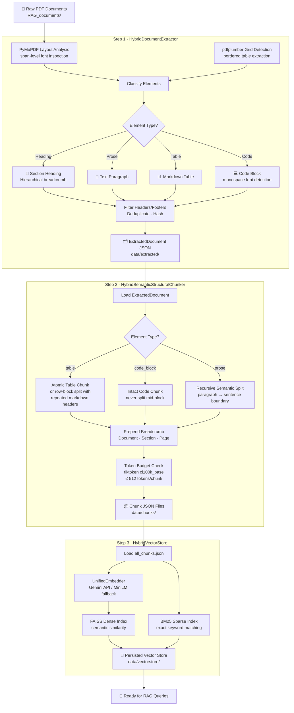
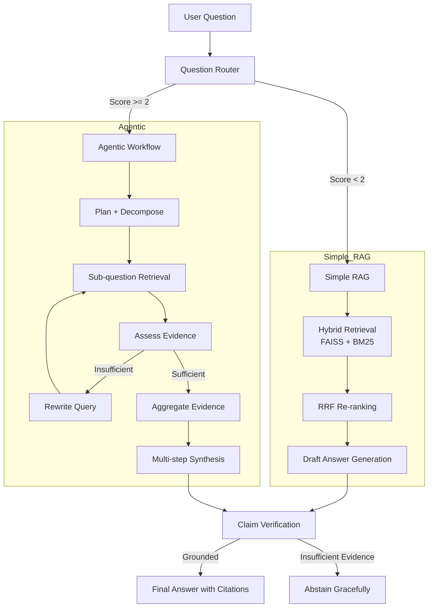

# Intelligent Knowledge Assistant

A production-style enterprise knowledge assistant that combines a multi-stage document ingestion pipeline with hybrid retrieval and adaptive agentic reasoning — answering technical questions grounded in a curated corpus.

## 1. Problem Understanding

Traditional single-pass LLM systems often struggle with technical knowledge work because they can:

- hallucinate when the requested answer is outside the evidence base,
- miss cross-document dependencies,
- fail on comparative or multi-step reasoning tasks,
- and produce answers without traceable evidence.

This project addresses those issues by building an intelligent retrieval system that:

- **extracts** rich structured content from source documents (text, tables, code blocks),
- **chunks** that content intelligently based on semantic and structural boundaries,
- **indexes** chunks into a hybrid vector store for fast retrieval,
- **searches** using both semantic and lexical signals at query time,
- **chooses** the appropriate workflow based on query complexity,
- **performs** iterative reasoning for difficult questions,
- and **verifies** claims before returning a final answer.

The system is tailored for the assessment corpus covering:
- RAG architecture patterns,
- vector database comparison,
- and agentic AI frameworks.

---

## 2. System Overview

The project is divided into two major stages:

| Stage | When it runs | Purpose |
|---|---|---|
| **Stage 1 · Data Extraction & Ingestion** | Once, offline | Parse PDFs → extract elements → chunk → index |
| **Stage 2 · Query & Answering** | Every user query | Route → retrieve → reason → verify → respond |

---

## 3. Stage 1 — Data Extraction & Ingestion Pipeline

Before any questions can be answered, the raw PDF documents must be processed and indexed. This is a **one-time offline pipeline** that transforms unstructured documents into a searchable knowledge base.

### 3.1 What the Pipeline Does

The ingestion pipeline has three sequential steps:

```
PDFs  →  [1. Extraction]  →  [2. Chunking]  →  [3. Vector Indexing]
```

### 3.2 Pipeline Flow Diagram



### 3.3 Step-by-Step Breakdown

#### Step 1 — Document Extraction (`HybridDocumentExtractor`)

**Script:** `python scripts/run_extraction.py`

The extractor uses two complementary libraries simultaneously on every PDF page:

| Library | What it detects |
|---|---|
| **PyMuPDF** (`fitz`) | Span-level font styles — identifies headings (bold/large), monospace code, and reading order across multi-column layouts |
| **pdfplumber** | Grid-line-based table detection — captures structured tables with explicit borders |

After detection, every element is classified as one of:

- **Heading** — tracked to maintain a live hierarchical section path (e.g., `Chapter 3 > 3.2 Hybrid Search`)
- **Paragraph** — regular prose text
- **Table** — converted to Markdown format for LLM compatibility
- **Code block** — preserved verbatim for accuracy

Headers, footers, page numbers, and near-duplicate fragments are filtered out. Each document is saved as a structured JSON file in `data/extracted/`.

**Example extracted element:**
```json
{
  "element_type": "table",
  "text": "| Database | Latency | Cost |\n|---|---|---|\n...",
  "section_path": "3 Vector Databases > 3.2 Comparison",
  "page_number": 18
}
```

---

#### Step 2 — Semantic-Structural Chunking (`HybridSemanticStructuralChunker`)

**Script:** `python scripts/run_chunking.py`

Raw extracted elements are too long or too fragmented for direct retrieval. The chunker applies **content-type-aware splitting rules**:

| Element Type | Chunking Strategy |
|---|---|
| **Table** | Kept as a single atomic chunk; if over token limit, split by row-block with the header row repeated in each sub-chunk |
| **Code block** | Always preserved intact — never split mid-block |
| **Prose paragraph** | Recursively split on paragraph break → sentence boundary until within the token budget |

Every chunk gets a **contextual breadcrumb prepended** before embedding:

```
[Document: Rag Architecture Patterns | Section: 1.2 Retrieve-Then-Generate | Page: 3]
The canonical RAG pipeline consists of three stages ...
```

This breadcrumb is critical — it tells the embedding model *where* in the document the content comes from, dramatically improving retrieval precision.

**Token budgeting** uses `tiktoken` (OpenAI's `cl100k_base` tokenizer) to target ≤ 512 tokens per chunk.

**Outputs:** Per-document `*_chunks.json` files + a unified `all_chunks.json` + a manifest with statistics.

---

#### Step 3 — Hybrid Vector Store Indexing (`HybridVectorStore`)

**Script:** `python scripts/build_vector_store.py`

The chunked content is indexed into a **dual-index hybrid store**:

| Index | Technology | What it captures |
|---|---|---|
| **Dense** | FAISS (cosine) | Semantic meaning — "what the text is *about*" |
| **Sparse** | BM25 | Exact keyword matches — technical terms, acronyms, model names |

**Embedding provider** is automatically selected:
- **Gemini Embedding API** (preferred, when key is configured)
- **`all-MiniLM-L6-v2`** via `sentence-transformers` (local fallback, no API needed)

Both indexes are persisted to `data/vectorstore/` and loaded instantly at query time without re-indexing.

---

### 3.4 Running the Ingestion Pipeline

Run these three commands once, in order:

```bash
# Step 1 — Extract structured elements from all PDFs
python scripts/run_extraction.py

# Step 2 — Chunk extracted documents
python scripts/run_chunking.py

# Step 3 — Build and persist the hybrid vector store
python scripts/build_vector_store.py
```

> **Note:** Steps 2 and 3 depend on the outputs of the previous step. Only re-run step 1 with `--force` if the source documents change.

---

## 4. Stage 2 — Query & Answering Pipeline

Once the vector store is built, every user question flows through the following pipeline.

### 4.1 Solution Overview

The system routes each user question to one of two execution paths:

- **Simple RAG** — for direct factual or single-document questions
- **Agentic workflow** — for multi-step, comparative, or decomposition-heavy questions

This makes the assistant efficient for simple tasks while remaining capable on complex enterprise queries.

### 4.2 Query Pipeline Flow Diagram



### 4.3 Query Complexity Routing

The router scores each query against a rubric and routes to the right workflow:

| Query Characteristic | Score |
|---|---|
| Direct factual question | +0 |
| Requires one focused retrieval | +0 |
| Requires comparison | +2 |
| Requires multiple independent facts | +2 |
| Requires multiple documents | +2 |
| Requires query decomposition | +2 |
| Requires calculations or external tools | +3 |
| Requires iterative search | +3 |
| Requires planning or multi-step reasoning | +3 |

**Score < 2 → Simple RAG** · **Score ≥ 2 → Agentic Workflow**

---

## 5. Key Features

### 5.1 Hybrid Retrieval

- Dense semantic search using FAISS
- Sparse lexical search using BM25
- Reciprocal Rank Fusion (RRF) to merge ranked results

### 5.2 Adaptive Routing

A scoring rubric evaluates query complexity and routes to the appropriate workflow — keeping simple queries fast while reserving multi-step reasoning for questions that genuinely need it.

### 5.3 Agentic Reasoning (ReAct-style)

For complex questions, the system uses a **ReAct (Reasoning + Acting)** loop:

- plans the work and decomposes the query into sub-questions,
- performs evidence retrieval per sub-question,
- rewrites queries when evidence is weak (iterative search),
- and synthesizes a multi-source answer.

### 5.4 Grounding and Verification

Before returning a final answer, the system verifies claims against retrieved evidence and **abstains gracefully** when verification fails — preferring honesty over hallucination.

### 5.5 API and UI

The solution exposes:

- a **FastAPI** backend for production integration,
- a **Streamlit** interface for demonstration and user interaction,
- a **Docker**-based deployment path.

---

## 6. Project Structure

```text
Assingment_AZ/
├── .env.example
├── .gitignore
├── Dockerfile
├── README.md
├── app.py                          ← Streamlit UI
├── docker-compose.yml
├── requirements.txt
├── RAG_documents/                  ← Source PDF files (input)
│   └── *.pdf
├── scripts/
│   ├── run_extraction.py           ← Step 1: PDF → JSON elements
│   ├── run_chunking.py             ← Step 2: JSON elements → chunks
│   ├── build_vector_store.py       ← Step 3: chunks → FAISS+BM25 index
│   └── run_evaluation.py           ← Optional: run eval dataset
├── src/
│   ├── ingestion/
│   │   ├── extractor.py            ← HybridDocumentExtractor (PyMuPDF + pdfplumber)
│   │   ├── chunker.py              ← HybridSemanticStructuralChunker
│   │   ├── embedder.py             ← UnifiedEmbedder (Gemini / MiniLM)
│   │   ├── vector_store.py         ← HybridVectorStore (FAISS + BM25)
│   │   ├── pipeline.py             ← ExtractionPipeline orchestrator
│   │   └── models.py               ← Pydantic data models
│   ├── rag/
│   │   ├── router.py               ← Complexity scoring & routing
│   │   ├── simple_rag.py           ← SimpleRAGPipeline
│   │   ├── service.py              ← Top-level query service
│   │   └── metadata.py             ← Document metadata registry
│   ├── agent/
│   │   ├── orchestrator.py         ← Agentic ReAct loop
│   │   └── state.py                ← Agent state management
│   ├── llm/
│   │   └── client.py               ← OpenRouter / Gemini LLM client
│   ├── api/
│   │   ├── main.py                 ← FastAPI application
│   │   └── schemas.py              ← API request/response schemas
│   └── config.py                   ← Central configuration
├── data/
│   ├── extracted/                  ← Step 1 outputs (JSON per document)
│   ├── chunks/                     ← Step 2 outputs (chunked JSON)
│   └── vectorstore/                ← Step 3 outputs (FAISS + BM25 index)
└── tests/
    ├── test_api.py
    ├── test_rag.py
    └── test_router.py
```

---

## 7. Setup and Installation

### Prerequisites

- Python 3.10+
- pip
- Docker (optional)
- API access for Gemini and/or OpenRouter depending on active provider configuration

### Local Setup

```bash
git clone <repository-url>
cd Assingment_AZ

python -m venv .venv
source .venv/bin/activate
# or on Windows:
# .venv\Scripts\activate

pip install -r requirements.txt
cp .env.example .env
```

Update `.env` with your keys and model configuration. Keep secrets out of source control.

Example:

```env
GEMINI_API_KEY=your_gemini_key_here
OPENROUTER_API_KEY=your_openrouter_key_here
LLM_PRIMARY_MODEL=google/gemma-4-31b-it
LLM_COMPLEX_MODEL=qwen/qwen3.8-27b
```

---

## 8. Running the Project

### 8.1 One-time: Build the Knowledge Base

```bash
# Step 1 — Extract content from PDFs
python scripts/run_extraction.py

# Step 2 — Chunk documents
python scripts/run_chunking.py

# Step 3 — Build the hybrid vector store
python scripts/build_vector_store.py
```

### 8.2 Run the Streamlit UI

```bash
streamlit run app.py
```

Open: http://localhost:8501

### 8.3 Run the FastAPI backend

```bash
python -m uvicorn src.api.main:app --host 0.0.0.0 --port 8000 --reload
```

Open: http://localhost:8000/docs

### 8.4 Run with Docker Compose

```bash
docker-compose up --build
```

This starts:
- FastAPI backend on port 8000
- Streamlit UI on port 8501

---

## 9. API Usage

### Health Check

```bash
curl http://localhost:8000/api/v1/health
```

### Router Evaluation

```bash
curl -X POST "http://localhost:8000/api/v1/route" \
  -H "Content-Type: application/json" \
  -d '{
    "query": "Compare FAISS and Pinecone on latency and cost trade-offs."
  }'
```

### End-to-End Query

```bash
curl -X POST "http://localhost:8000/api/v1/query" \
  -H "Content-Type: application/json" \
  -d '{
    "query": "What is Reciprocal Rank Fusion?",
    "force_workflow": "auto"
  }'
```

Example response summary:

```json
{
  "query": "What is Reciprocal Rank Fusion?",
  "workflow": "simple_rag",
  "answer": "Reciprocal Rank Fusion (RRF) combines multiple ranked lists using reciprocal ranks.",
  "confidence": 0.95,
  "sources": [
    {
      "doc_name": "rag_architecture_patterns.pdf",
      "page_number": 2,
      "section": "Hybrid Search and Ranking",
      "snippet": "RRF combines rankings by summing reciprocal ranks."
    }
  ],
  "verification": {
    "status": "supported",
    "is_grounded": true
  },
  "abstained": false
}
```

---

## 10. Design Decisions

### 10.1 Hybrid Extraction (PyMuPDF + pdfplumber)

Using two libraries simultaneously is intentional. PyMuPDF excels at span-level font analysis for detecting headings and code, while pdfplumber is superior at detecting grid-line tables. Neither alone handles all document layouts reliably.

### 10.2 Content-type Aware Chunking

Tables and code blocks must never be split mid-way — doing so destroys their meaning. The chunker applies strict element-type rules, treating these as atomic units and only applying recursive splitting to prose.

### 10.3 Breadcrumb-enhanced Embeddings

Prepending the document name, section path, and page number to every chunk before embedding dramatically improves retrieval precision. The embedding model learns to associate content with its structural location in the document, not just its words.

### 10.4 Hybrid Retrieval

The system uses both dense and sparse retrieval to mitigate the weaknesses of each approach. Dense search captures semantic similarity, while BM25 captures exact technical terms and acronyms.

### 10.5 Workflow Routing

The router classifies queries based on complexity to avoid applying expensive agentic processing to straightforward questions. This improves responsiveness while preserving depth for complex tasks.

### 10.6 Grounded Answering

The system is designed to prefer abstention over hallucination. When evidence is insufficient, it explicitly communicates that the documents do not provide enough support for a confident answer.

### 10.7 Verification-first Processing

The final answer is checked against retrieved sources before returning, which adds an important trust and safety layer for enterprise use cases.

---

## 11. Evaluation and Validation

The project includes automated tests covering:

- API contract validation,
- router classification logic,
- and core RAG behaviors.

Example command:

```bash
python -m pytest -q
```

The current project test suite passes successfully in the repository environment, confirming the core implementation is working as expected.

---

## 12. Limitations

- Agentic workflows are slower than simple retrieval because they perform multiple LLM calls.
- Real-world performance depends on API availability and quota limits.
- The quality of retrieval depends on the structure and coverage of the document corpus.
- Verification is still LLM-assisted and should be tightened further for highly sensitive domains.

---

## 13. Future Production Improvements

- Add asynchronous sub-question processing to reduce latency.
- Integrate a cross-encoder reranker for stronger evidence ordering.
- Add persistent conversation memory for multi-turn workflows.
- Add tracing, observability, and error telemetry for production deployment.
- Harden prompt guardrails and stricter abstention thresholds.
- Extend automatic evaluation with benchmark scripts for latency, grounding, and recall.

---

## 14. Conclusion

This project demonstrates a practical end-to-end design for an enterprise knowledge assistant. It spans the full pipeline from raw PDF ingestion to verified, grounded answers — blending structured extraction, intelligent chunking, hybrid retrieval, adaptive routing, and iterative reasoning into a unified system.

The solution is structured to be both transparent and production-minded: it is explainable, testable, and capable of handling both brief factual queries and complex comparative analysis.

---

## 15. Repository Status

This repository contains:

- source code,
- API and UI interfaces,
- environment template,
- Docker deployment files,
- test suite,
- and documentation for local and containerized execution.

It is ready to be used as a submission-ready technical project for GitHub review.
